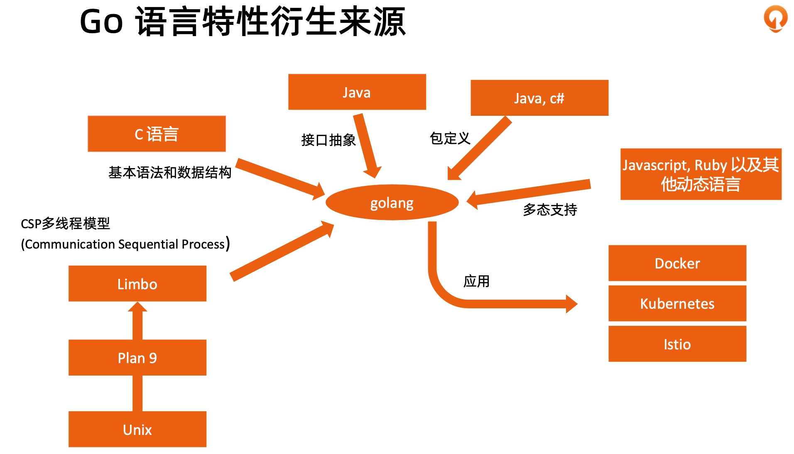
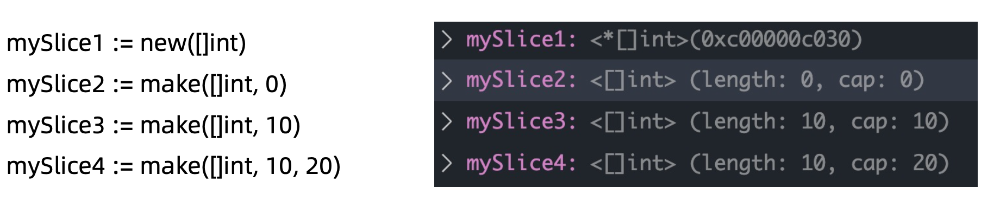
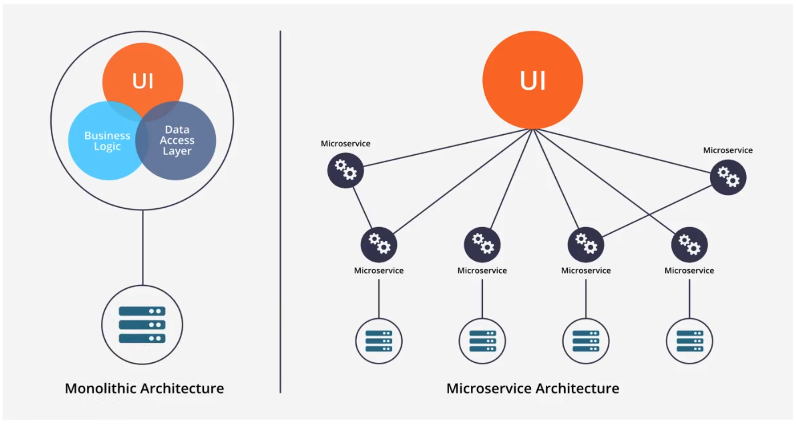
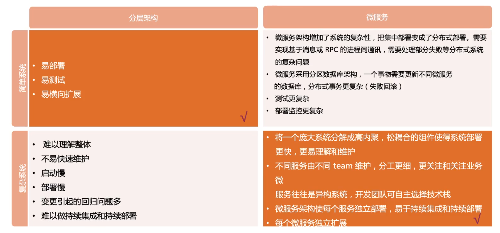
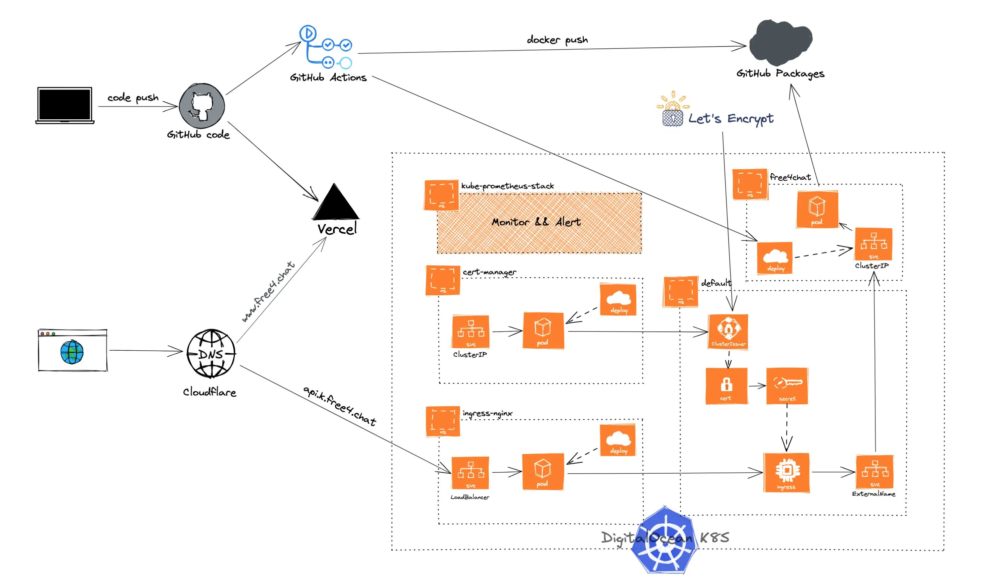

# cloud-native-boot-camp

## Pre-learning

[https://learnku.com/docs/the-way-to-go](https://learnku.com/docs/the-way-to-go)

[https://draveness.me/golang/](https://draveness.me/golang/)

[https://github.com/cncamp/101](https://github.com/cncamp/101)

- readme中列举了三种办法, minikube, kubead, kind
- 对于机器配置不够好的同学，建议试一下kind
- 对于机器性能不错的同学，建议用kubeadm

[kubelet podWorker启动pod代码细节](https://pouncing-waterfall-7c4.notion.site/kubelet-go-c3b5cf9bbf4b4e3098720f61efb15e0e)

## 什么是云原生

- 在包括公有云、私有云、混合云等动态环境中构建和运行规模化应用的能力。
- 云原生是一种思想，是技术、企业管理方法的集合。
  - 技术层面
    - 应用程序从设计之初就为在云上运行而做好准备。
    - 云平台基于自动化体系。
  - 流程层面
    - 基于 DevOps, CI/CD。
- 基于多种手段
  - 应用容器化封装;
  - 服务网格;
  - 不可变基础架构;
  - 声明式 API。
- 云原生的意义
  - 提升系统的适应性、可管理性、可观察性;
  - 使工程师能以最小成本进行频繁和可预测的系统变更。
  - 提升速度和效率，助力业务成长，缩短 I2M(Idea to Market)

### 学习建议

- 云原生中基础架构的部分是计算机领域最复杂的领域之一， 学习云原生是突破自我的机会!
- 云原生涉及到的知识面很广，不懂的概念不用急于求成，反 复训练可强化理解。
- 实践出真知，多听，多学，多练。

## 03-Go语言特性

### 为什么需要 Go 语言

- 其他编程语言的弊端。
  - 硬件发展速度远远超过软件。
  - C 语言等原生语言缺乏好的依赖管理 (依赖头文件)。
  - Java 和 C++ 等语言过于笨重。
  - 系统语言对垃圾回收和并行计算等基础功能缺乏支持。
  - 对多核计算机缺乏支持。
- Go 语言是一个可以编译高效，支持高并发的，面向垃圾回收的全新语言。
  - 秒级完成大型程序的单节点编译。
  - 依赖管理清晰。
  - 不支持继承，程序员无需花费精力定义不同类型之间的关系。 • 支持垃圾回收，支持并发执行，支持多线程通讯。
  - 对多核计算机支持友好。

### Go 语言不支持的特性

- 不支持函数重载和操作符重载
- 为了避免在C/C++开发中的一些Bug和混乱，不支持隐式转换 • 支持接口抽象，不支持继承
- 不支持动态加载代码
- 不支持动态链接库
- 通过recover和panic来替代异常机制
- 不支持断言
- 不支持静态变量

### Go 语言环境搭建

- Go 安装文件以及源代码
  - `https://golang.google.cn/dl/`
- 下载对应平台的二进制文件并安装
- 环境变量
  - GOROOT
    - go的安装目录
  - GOPATH
    - src:存放源代码
    - pkg:存放依赖包
    - bin:存放可执行文件
  - 其他常用变量
    - GOOS，GOARCH，GOPROXY
    - 国内用户建议设置 goproxy: `export GOPROXY=https://goproxy.cn`

> 最好写到 `.zshrc` 里。

### 常用数据结构

- 常量 const identifier type
- 变量 var identifier type

#### 变量定义

- 变量
  - var 语句用于声明一个变量列表，跟函数的参数列表一样，类型在最后。
  - var c, python, java bool
- 变量的初始化
  - 变量声明可以包含初始值，每个变量对应一个。
  - 如果初始化值已存在，则可以省略类型;变量会从初始值中获得类型。
  - vari,jint=1,2
- 短变量声明
  - 在函数中，简洁赋值语句 := 可在类型明确的地方代替 var 声明。
  - 函数外的每个语句都必须以关键字开始(var, func 等等)，因此 := 结构不能在函数外使用。
  - c, python, java := true, false, "no!"

#### 切片

- 切片是对数组一个连续片段的引用
- 数组定义中不指定长度即为切片
  - varidentifier[]type
- 切片在未初始化之前默认为nil，长度为0
- 常用方法

#### Make 和 New

- New返回指针地址
- Make返回第一个元素，可预设内存空间，避免未来的内存拷贝
- 示例

## 04-Go语言进阶

## 05-Docker

> 竟然讲到了 SOA 和 ESB，前两天考 **“2021年的软考高级系统架构师”** 背的死去活来的，真心不如用心去学一下。

- 故事讲的是 `IBM` `800个人` 的开发产品，开发投入巨大，但最后将 `800个人` 的代码和到一起时，问题出现了：没有一个人敢说产品可以上线、没有人知道怎么变更一个功能会对系统有多大的影响、最后系统基本没法维护，这个产品什么时候可以发布，只有产品经理说，测试们不要继续测试了，然后 bugs 数量降下来了，大家装作没什么问题一样的，让产品上线了！
- 从此之后 `IBM` 推出了 SOA 架构风格。因为人的脑容量有限，没有人能看透全部，看清所有业务逻辑。

## 06-Kubernetes 架构原则和对象设计

## 07-Kubernetes 控制平面组件 etcd

## 08-Kubernetes 控制平面组件 API Server

## 09-Kubernetes 控制平面组件 调度器和控制器
